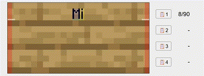

# Minecraft Advanced Sign Tools
A collection of advanced tools that help you create ASCII art for Minecraft signs, and more.



## Usage
You can access the [GitHub-hosted version here](https://bdev42.github.io/mc-advanced-sign-tools/).
The project is a static website without any dependencies, so you can also run it locally with **any basic webserver**. For example, if you have python installed:
```bash
git clone --depth 1 https://github.com/bdev42/mc-advanced-sign-tools.git mast
cd mast
python3 -m http.server
```

## License
The code in this project is open source and licensed under the [MIT License](LICENSE.md), including the data files and assets generated by the tools or contributed by the community.
> **Important Note:** The files and assets located in the `external` directory are *not* covered by the project license, and may be subject to their own licenses or restrictions. 

## Contributing
Community contributions are welcome and appreciated! Please continue reading to learn how you can get involved.

* [Ask a question](https://github.com/bdev42/mc-advanced-sign-tools/issues/new?template=question.md)
* [Report a bug](https://github.com/bdev42/mc-advanced-sign-tools/issues/new?template=bug_report.md)
* [Suggest an enhancement](https://github.com/bdev42/mc-advanced-sign-tools/issues/new?template=feature_request.md)

---
Smaller contributions like bug fixes, improving the documentation, or adding helpful code comments are always welcome!
If you are considering a larger contribution (like adding a new feature or improving an existing one), please open an issue to discuss the idea beforehand. This helps ensure alignment with the project's direction.

_As always, please understand that some contributions may not get merged. This isn't a reflection of your skills or the quality of your code, but simply how well it fits the project._

### General Guidelines
The tools should be as **fast** and **simple** as possible, but without compromising **usefulness**. A small project like this one does not need any dependencies to achieve this, as such please follow a _zero-dependency principle_ in your contributions to keep the project as lightweight as possible.
